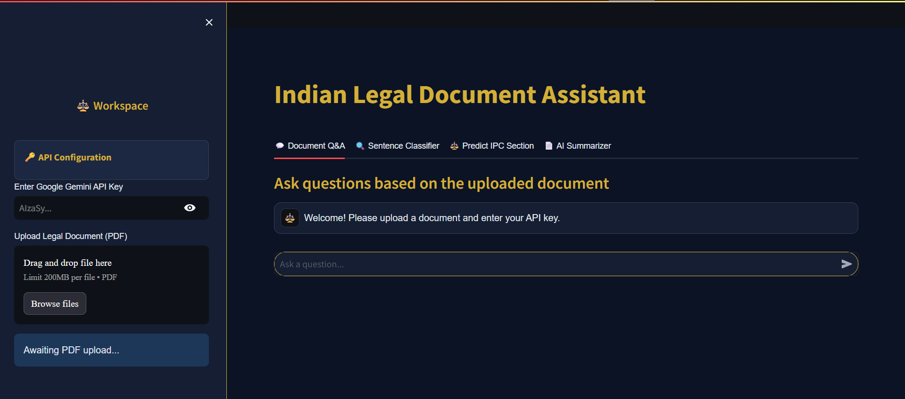
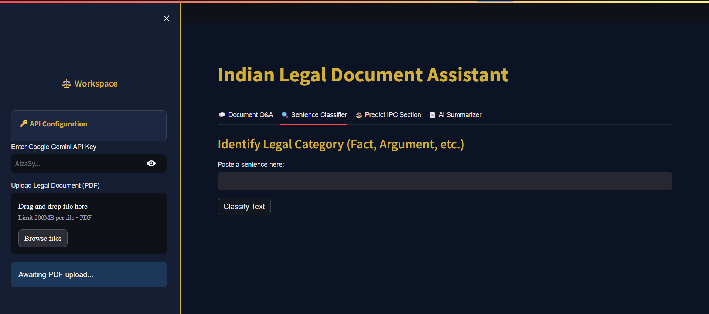
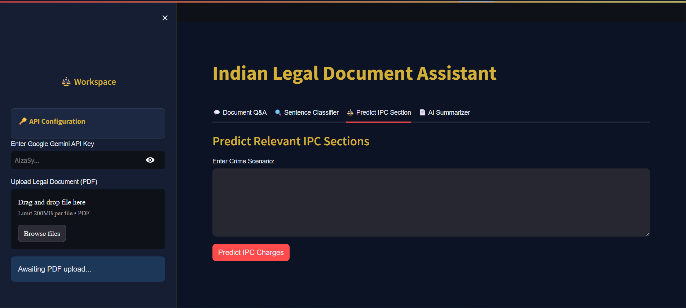
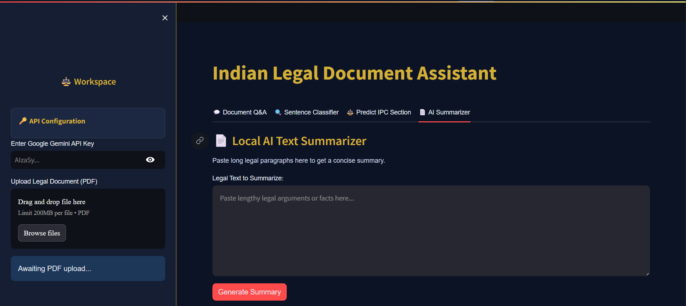
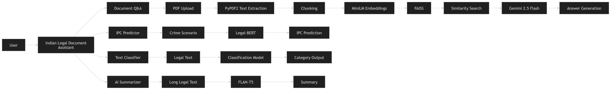

# ⚖️ Indian Legal AI Assistant (ILAA)

An AI-powered Legal Assistant that combines **Retrieval-Augmented Generation (RAG), Legal-BERT, FAISS, Gemini, and FLAN-T5** to help users analyze legal documents, predict IPC sections, classify legal text, and generate concise legal summaries.

---

## 🚀 Live Demo

### 🔗 Try the Application

**Hugging Face Deployment:**

https://huggingface.co/spaces/Sandeep-Kaur12/Indian-Legal-AI-Assistant

### 💻 GitHub Repository

https://github.com/SandeepKaur098/ILAA

---

# 📖 Project Overview

Legal documents are often lengthy, complex, and difficult to understand for non-legal professionals.

The Indian Legal AI Assistant simplifies legal document analysis using Artificial Intelligence, Natural Language Processing, Deep Learning, and Large Language Models.

The system enables users to:

* Upload legal PDF documents
* Ask questions about uploaded documents
* Predict relevant IPC sections from crime scenarios
* Classify legal statements into legal categories
* Generate concise summaries of lengthy legal text

This project demonstrates practical implementation of:

* Retrieval-Augmented Generation (RAG)
* Transformer-Based NLP Models
* Semantic Search
* Vector Databases
* Large Language Models
* Legal Domain AI Applications

---

# 📸 Application Screenshots

## 🏠 Home / Document Q&A



---

## 🔍 Legal Text Classification



---

## ⚖️ IPC Section Prediction



---

## 📄 AI Legal Summarizer



---

# 🏗️ System Architecture



---

# ✨ Key Features

## 📄 1. Document Question Answering (RAG)

Upload legal PDF documents and ask questions in natural language.

### Workflow

* PDF Upload
* Text Extraction using PyPDF2
* Text Chunking
* Sentence Embedding Generation
* FAISS Vector Storage
* Similarity Search
* Gemini 2.5 Flash Response Generation

### Example

Input:

```text
Who is the petitioner in this case?
```

Output:

```text
Answer generated directly from the uploaded document context.
```

---

## ⚖️ 2. IPC Section Prediction

Predicts the most relevant IPC sections from a crime scenario using a Legal-BERT based multi-label classification model.

### Example

Input:

```text
A person intentionally attacked another person with a sharp weapon causing severe injuries.
```

Output:

```text
IPC Section 324
Confidence Score

IPC Section 326
Confidence Score
```

### Highlights

* Legal-BERT Based
* Multi-Label Classification
* Dynamic Threshold Optimization
* Top-3 Predictions Returned

---

## 🏛️ 3. Legal Text Classification

Classifies legal statements into predefined legal categories.

### Supported Categories

* Analysis
* Argument (Petitioner)
* Argument (Respondent)
* Fact
* Issue
* Statute
* Preamble
* Precedent
* Ratio Decidendi
* Court Ruling

### Example

Input:

```text
The accused entered the property without permission.
```

Output:

```text
Fact (FAC)
```

---

## 📝 4. AI Legal Summarization

Generates concise summaries of lengthy legal text using FLAN-T5.

### Example

Input:

```text
Long legal arguments and court observations...
```

Output:

```text
Short summary containing key legal points and decisions.
```

---

# 🧠 AI Models Used

## Legal Document Question Answering

### Model

Gemini 2.5 Flash

### Technique

Retrieval-Augmented Generation (RAG)

### Purpose

Generate document-grounded answers while minimizing hallucinations.

---

## IPC Section Prediction

### Base Model

Legal-BERT

### Architecture

```text
Legal-BERT
     ↓
Dropout Layer
     ↓
Linear Layer
     ↓
Sigmoid Activation
     ↓
Multi-Label IPC Prediction
```

### Purpose

Predict applicable IPC sections from crime descriptions.

---

## Legal Text Classification

### Model

Fine-Tuned Transformer Classifier

### Purpose

Classify legal statements into rhetorical and legal categories.

---

## Legal Summarization

### Model

FLAN-T5 Base

### Purpose

Generate concise legal summaries while preserving important information.

---

# 🛠️ Tech Stack

## Frontend

* Streamlit

## Backend

* Python

## Deep Learning

* PyTorch

## NLP & Transformers

* Hugging Face Transformers
* Legal-BERT
* FLAN-T5

## Vector Database

* FAISS

## Embedding Model

* all-MiniLM-L6-v2

## LLM

* Gemini 2.5 Flash

## PDF Processing

* PyPDF2

---

# 📂 Repository Structure

```text
ILAA/
│
├── assets/
│   ├── architecture.png
│   ├── home.png
│   ├── classifier.png
│   ├── ipc_predictor.png
│   └── summarizer.png
│
├── notebooks/
│   ├── IPC_Section_Prediction_Training.ipynb
│   └── Legal_Text_Classification_Training.ipynb
│
├── LICENSE
├── README.md
├── app.py
├── inference.py
├── requirements.txt
└── .gitignore
```

---

# 📚 Training Notebooks

The model development and experimentation notebooks are available in the `notebooks/` directory.

### IPC Section Prediction

* Data Preprocessing
* Legal-BERT Fine-Tuning
* Multi-Label Classification
* Threshold Optimization

### Legal Text Classification

* Dataset Preparation
* Text Classification Pipeline
* Transformer Fine-Tuning
* Model Evaluation

---

# ⚙️ Installation

## Clone Repository

```bash
git clone https://github.com/SandeepKaur098/ILAA.git

cd ILAA
```

## Create Virtual Environment

```bash
python -m venv venv
```

### Windows

```bash
venv\Scripts\activate
```

### Linux / Mac

```bash
source venv/bin/activate
```

## Install Dependencies

```bash
pip install -r requirements.txt
```

## Run Application

```bash
streamlit run app.py
```

---

# 🎯 Skills Demonstrated

* Artificial Intelligence
* Machine Learning
* Deep Learning
* Natural Language Processing
* Generative AI
* Retrieval-Augmented Generation (RAG)
* Transformer Models
* Vector Databases
* Semantic Search
* Prompt Engineering
* Streamlit Deployment
* End-to-End AI Application Development

---

# 🔮 Future Improvements

* Multi-Language Legal Support
* Voice-Based Legal Assistant
* Legal Citation Generation
* Case Recommendation System
* Multi-Document Querying
* Advanced Legal Reasoning Module
* Cloud-Based Model Hosting

---

# 👨‍💻 Author

### Sandeep Kaur

**B.Tech Computer Science Engineering**

Areas of Interest:

* Artificial Intelligence
* Machine Learning
* Deep Learning
* NLP
* Generative AI
* Large Language Models

### Connect With Me

💻 GitHub: https://github.com/SandeepKaur098

---

## ⭐ If you found this project useful, consider giving it a star on GitHub!
